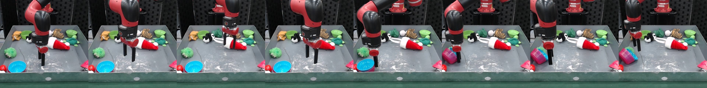
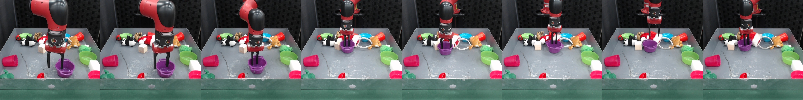
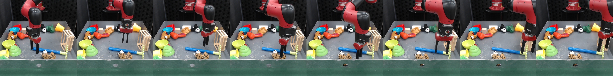

This dataset accompanies the paper [**MaskViT: Masked Visual Pre-Training for Video Prediction**](https://maskedvit.github.io/). 

At a high level, this is "RoboNet-style" data in that it is random interaction data collected by a robot arm
and a bin of objects, which are swapped out periodically. 
The objects mostly consist of soft stuffed toys and plastic objects.
The robot arm is controlled by a random policy with the 
autograsp primitive enabled. It is collected using the [Visual Foresight codebase](https://github.com/SudeepDasari/visual_foresight).

The dataset is collected using a single robot, and was collected in two parts of roughly equal size. 
These two parts have different camera 
configurations and slightly different object distributions. 

The dataset contains 9109 train episodes and 91 validation episodes. Each episode contains 30 steps.

Example trajectories:

